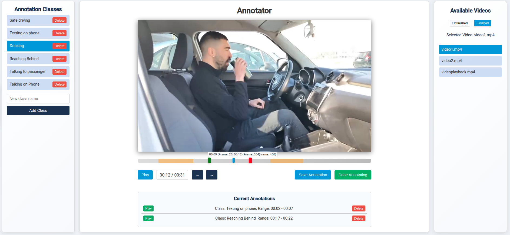

# Video Annotation Tool

A web-based application for annotating videos by setting start and end times using a draggable timebar. Users can select custom annotation classes, save annotations, and toggle between unfinished and finished videos. Built with Flask, HTML, CSS, and JavaScript.

## Features

- Annotate videos by selecting custom annotation classes.
- Set start and end times using a draggable timebar.
- Save, view, and delete annotations.
- Toggle between unfinished and finished videos.
- Responsive design for a seamless user experience.



## Installation

1. **Clone the Repository:**

```bash
git clone https://github.com/Theosiam/Video-Annotation-Tool.git
cd Video-Annotation-Tool
```

2. **Create a Virtual Environment (Optional but Recommended):**

```bash
python3 -m venv venv
source venv/bin/activate  # On Windows use: venv\Scripts\activate
```

3. **Install Dependencies:**

```bash
pip install Flask
```

4. **Configure File Paths:**

Ensure the file paths in `app.py` (e.g., `BASE_DIR`) are set correctly for your environment.

## Usage

1. **Run the Application:**

From the project root, start the Flask server:

```bash
python app.py
```

2. **Access the Application:**

Open your web browser and navigate to:

```
http://localhost:10200
```

3. **Annotate Videos:**

- Use the left panel to select, add or delete annotation classes.
- Select a video from the right panel for unfinished and finished folders.
- Use the center panel to set start and end markers on the custom timebar and control playback.
- Save your annotations and finalize the video when done.

## Project Structure

```
.
├── app.py                      # Main Flask application
├── annotation_classes.json     # JSON file for annotation classes
├── static
│   ├── index.html              # Front-end HTML file
│   ├── css
│   │   └── styles.css          # CSS styles for the application
│   └── js
│       └── scripts.js          # JavaScript for video controls and annotations
└── README.md                   # Project documentation (this file)
```

## Contributing

Contributions are welcome! Feel free to fork the repository and submit pull requests. For major changes, please open an issue first to discuss your ideas.

## License

This project is licensed under the MIT License.

